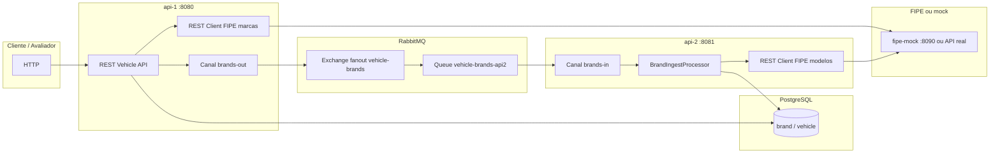

# file-vehicles

Monorepo **Java / Quarkus** com duas APIs e um mock HTTP da **FIPE**, alinhado ao desafio descrito em [`desafio.txt`](desafio.txt) (carga inicial, fila, persistência, REST de consulta e atualização, boas práticas de engenharia).

---

## Arquitetura em alto nível

No **GitHub**, o diagrama abaixo é desenhado automaticamente; na pré-visualização Markdown de algumas IDEs pode aparecer só como código.



### Módulos

| Módulo | Responsabilidade |
|--------|------------------|
| **`api-1`** | Contrato OpenAPI (`META-INF/openapi.yaml`): carga inicial (`POST` → **202** + enfileiramento por marca), listagem de marcas e veículos, `PATCH` de veículo por `id`. Usa **PostgreSQL** e publica mensagens no **RabbitMQ** (exchange fanout). |
| **`api-2`** | **Consumidor** da fila (uma mensagem por vez): para cada marca, chama a FIPE para **modelos**, persiste **marca** (se preciso) e **veículos** (`fipe_model_code`, `model_name`, etc.) no **mesmo Postgres**. Não expõe a API REST principal do desafio. |
| **`fipe-mock`** | Serviço **HTTP mínimo** (`GET /carros/marcas`, `GET /carros/marcas/{id}/modelos`) para desenvolvimento quando a FIPE oficial está indisponível; formato alinhado a `fipeapi.json`. |
| **`infra`** | `docker-compose.yml` **mínimo** (só Postgres + Rabbit para quem desenvolve com as apps na IDE) e **`sql/001_initial_schema.sql`** (schema `brand` / `vehicle`). |

### Fluxo de dados (resumo)

1. Cliente chama **`POST /api/v1/initial-load`** na api-1.  
2. A api-1 consulta **marcas** na FIPE (ou mock), depois publica **uma mensagem JSON por marca** no exchange **`vehicle-brands`**.  
3. A api-2 consome da fila **`vehicle-brands-api2`**, busca **modelos** na FIPE por código de marca e grava linhas em **`vehicle`** (e **`brand`** quando necessário).  
4. Consultas **`GET /api/v1/brands`**, **`GET /api/v1/brands/{brandId}/vehicles`**, **`PATCH /api/v1/vehicles/{id}`** são atendidas pela api-1 sobre o banco já populado.

Identidade na API REST: o veículo é sempre endereçado pelo **`id`** interno; o código numérico de modelo na FIPE é o campo **`fipeModelCode`** (não substitui `id` na URL).

---

## Subir tudo de uma vez (um único Docker Compose)

Na **raiz** do repositório existe o arquivo **`docker-compose.yml`**, que sobe **Postgres** (aplica o SQL inicial na primeira criação do volume), **RabbitMQ**, **fipe-mock**, **api-1** e **api-2**, com **build** das imagens Java (Maven roda dentro do Docker).

### Pré-requisitos

- [Docker](https://docs.docker.com/get-docker/) com **Docker Compose v2**
- Portas livres: **5432**, **5672**, **15672**, **8080**, **8081**, **8090**

### Comando

```bash
docker compose up -d --build
```

Na primeira execução o **`--build`** pode levar **vários minutos** (download de imagens base + dependências Maven). Execuções seguintes costumam ser bem mais rápidas.

### O que fica disponível

| Serviço | URL / porta | Notas |
|---------|------------|--------|
| **api-1** (REST) | http://localhost:8080 | Ex.: `POST /api/v1/initial-load`, `GET /api/v1/brands` |
| **api-2** | http://localhost:8081 | Sem REST de negócio; em dev existe `/q/dev-ui` (Quarkus) |
| **fipe-mock** | http://localhost:8090 | Simula trechos da FIPE usados pelo pipeline |
| **RabbitMQ Management** | http://localhost:15672 | Usuário / senha: `vehicle` / `vehicle` |
| **PostgreSQL** | `localhost:5432` | Banco `vehicle`, usuário / senha: `vehicle` / `vehicle` |

### Teste rápido

```bash
curl -X POST http://localhost:8080/api/v1/initial-load
curl http://localhost:8080/api/v1/brands
```

Aguarde alguns segundos após o `initial-load` para a api-2 processar a fila antes de esperar veículos nas consultas por marca.

### Parar e limpar

```bash
docker compose down           # mantém volumes (dados no Postgres / estado Rabbit)
docker compose down -v        # apaga volumes — na próxima subida o SQL inicial corre de novo
```

Se também usar o compose **mínimo** em [`infra/docker-compose.yml`](infra/docker-compose.yml) (`docker compose up` dentro de `infra/`), **não rode os dois ao mesmo tempo** nas mesmas portas.

### Atalhos em `infra/`

Os scripts [`infra/up-stack.ps1`](infra/up-stack.ps1) e [`infra/up-stack.sh`](infra/up-stack.sh) sobem a **mesma** stack a partir da raiz do repo.

---

## Documentação por módulo

- [`api-1/README.md`](api-1/README.md) — endpoints, variáveis, alinhamento ao `desafio.txt`
- [`api-2/README.md`](api-2/README.md) — consumo da fila, FIPE modelos, persistência
- [`fipe-mock/README.md`](fipe-mock/README.md) — mock e contrato HTTP
- [`infra/README.md`](infra/README.md) — Postgres/Rabbit só com Docker, credenciais, SQL inicial

---

## Build local sem Docker (desenvolvimento)

Na raiz (requer JDK 17+):

```bash
./mvnw -pl fipe-mock,api-1,api-2 -am verify
```

Ou entre em cada módulo com `mvnw` e use `quarkus:dev` conforme os READMEs dos módulos.

---

## Referências

- Contrato da API pública: `api-1/src/main/resources/META-INF/openapi.yaml`
- Esquema lógico da FIPE (referência): [`fipeapi.json`](fipeapi.json) na raiz
